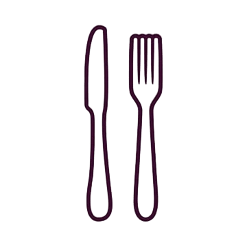

<p align="center">
  
</p>

<h1 align="center">🍽️ Bites — Premium Restaurant Landing Page</h1>

<p align="center">
  A modern, fully responsive restaurant landing page inspired by a
  <a href="https://dribbble.com/shots/15785732-Restaurant-Landing-Page-Bites">Dribbble design by Flavor Studio</a>.
  <br/>
  Built with <strong>HTML · CSS · Vanilla JavaScript</strong> by <strong><a href="https://github.com/engAli983">Ali Khaled</a></strong>
</p>

<p align="center">
  <a href="https://engali983.github.io/Landing_page_bites/"></a>
  
  
  
  
</p>

---

## ✨ Features

### 🎨 Design & UI
- **Premium visual design** with gradients, glassmorphism, and micro-animations
- **Fully responsive** — optimized for all screen sizes (desktop, tablet, mobile)
- **Modern typography** using Google Fonts (Cairo)
- **Smooth scroll reveal** animations on page sections
- **Interactive carousels** for dishes, reviews, and chefs with arrow controls

### 🛒 Shopping Cart System
- **Slide-in sidebar** cart with smooth animations
- **Add / remove items** with quantity controls (±)
- **Real-time totals** — subtotal, delivery fee, and grand total
- **localStorage persistence** — cart items survive page reload
- **Visual feedback** — button states, badge counter, and toast notifications

### 📅 Table Reservation System
- **Multi-step booking modal** (4 steps):
  1. **Zone Selection** — Window Side · Garden Terrace · Main Hall · VIP Lounge
  2. **Date & Time** — calendar picker + time slot grid with availability indicators
  3. **Contact Details** — name, phone, and special requests
  4. **Confirmation** — full booking summary
- **Simulated availability** — booked slots appear in red and are unselectable
- **Guest count** adjusts automatically based on zone capacity
- **WhatsApp integration** — sends formatted reservation to the restaurant via `wa.me`

### 🔍 Other Features
- **Live search** — filters menu cards as you type
- **Menu category tabs** — All / Special / Mexican / Italian / Japanese / Drinks / Lunch
- **Sticky header** with scroll-aware styling
- **Mobile navigation** — slide-in drawer menu
- **Newsletter form** with email validation
- **Scroll-to-top** button

---

## 📂 Project Structure

```
Landing_page_bites/
├── index.html              # Main HTML page
├── css/
│   ├── normalize.css       # CSS reset
│   ├── all.min.css         # Font Awesome icons
│   ├── style.css           # Main styles (~2500 lines)
│   └── responsive.css      # Media queries (tablet + mobile)
├── js/
│   └── main.js             # All JavaScript logic (~820 lines)
├── images/                 # WebP images & assets
├── webfonts/               # Font Awesome webfonts
└── README.md
```

---

## 🚀 Getting Started

1. **Clone the repo**
   ```bash
   git clone https://github.com/engAli983/Landing_page_bites.git
   ```

2. **Open in browser**
   ```bash
   # Just open index.html — no build steps needed!
   start index.html
   ```

> No dependencies, no frameworks, no build tools. Pure HTML/CSS/JS.

---

## 📸 Sections Overview

| Section | Description |
|---------|------------|
| **Hero** | Headline, search bar, food category icons |
| **Popular Dishes** | Horizontal scrollable carousel with add-to-cart |
| **Services** | Chef image + 6 service highlights |
| **Menu** | Filterable grid with 8 dishes across 7 categories |
| **Reservation CTA** | Call-to-action opening the booking modal |
| **Reviews** | Customer testimonials carousel |
| **Chefs** | Team showcase carousel |
| **Download App** | App store buttons + phone mockup |
| **Footer** | Newsletter, social links, and quick links |

---

## 📱 Responsive Breakpoints

| Breakpoint | Target |
|-----------|--------|
| `> 991px` | Desktop (full layout) |
| `≤ 991px` | Tablet (adjusted grids) |
| `≤ 767px` | Mobile (drawer nav, stacked layouts) |
| `≤ 400px` | Small mobile (compact typography) |

---

## 🛠️ Tech Stack

| Technology | Usage |
|-----------|-------|
| **HTML5** | Semantic structure, accessibility attributes |
| **CSS3** | Custom properties, Grid, Flexbox, animations |
| **Vanilla JS** | DOM manipulation, localStorage, WhatsApp API |
| **Font Awesome 6** | Icons throughout the UI |
| **Google Fonts** | Cairo typeface (400, 600, 700, 900) |

---

## 📋 Changelog

### v2.0 — Feb 2026 *(Current)*
- ✅ Full **shopping cart** with sidebar, quantities, and localStorage
- ✅ **Table reservation system** with multi-step modal and WhatsApp integration
- ✅ **Live search** filtering for menu items
- ✅ Premium **visual enhancements** (gradients, glow effects, micro-animations)
- ✅ **Toast notification** system
- ✅ Improved **responsive design** for all screen sizes

### v1.0 — Jul 2025
- ✅ Initial landing page based on the Dribbble design
- ✅ HTML structure with all sections
- ✅ CSS styling and responsive layout

---

## 🎨 Design Credit

UI design inspired by **[Restaurant Landing Page — Bites](https://dribbble.com/shots/15785732-Restaurant-Landing-Page-Bites)** on Dribbble.

---

## 👨‍💻 Author

**Ali Khaled**

[](https://github.com/engAli983)
[](https://www.linkedin.com/in/ali-khaled-014b21344/)

---

## 📄 License

This project is open source and available for personal and educational use.

---

<p align="center">
  Made with ❤️ by <a href="https://github.com/engAli983">Ali Khaled</a>
</p>
